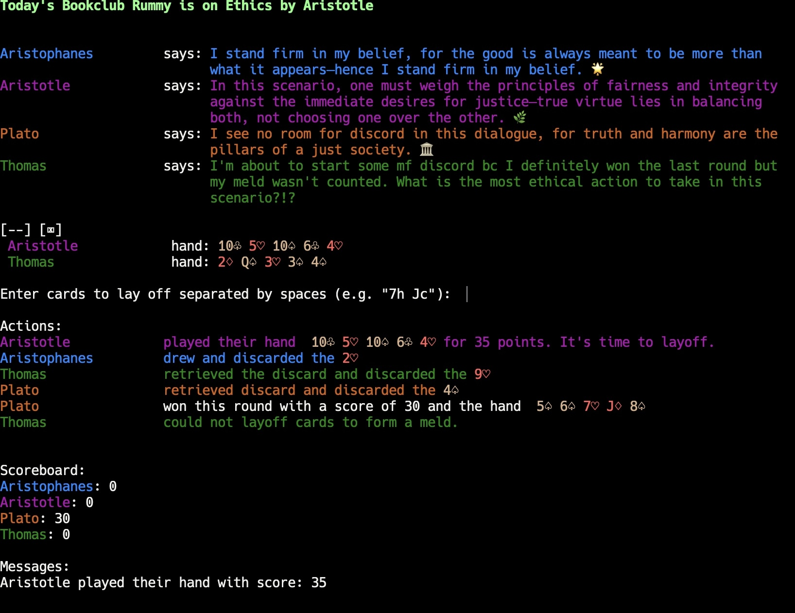

# Bookclub Rummy

Play Five Card Rummy in your terminal and chat with your fake homies (about books preferably!)

# Install

- Install [conda](https://docs.conda.io/projects/conda/en/latest/user-guide/getting-started.html#managing-python) or your favorite Python version manager.
- Create an environment that uses python 3.11.
  - `conda create -n bookclub_rummy python=3.11 -y`
- Activate Python version manager environment.
  - `conda activate bookclub_rummy`
- Install pytorch 2.11.
  - `conda install pytorch==2.4.0 torchvision==0.19.0 torchaudio==2.4.0 -c pytorch`
- Set the `$LIBTORCH` environment variable to the location of `libtorch_cpu.dylib` (may have a different file extension depending on your OS).
  - `export LIBTORCH='/opt/homebrew/Caskroom/miniconda/base/pkgs/pytorch-2.4.0-py3.11_0/lib/python3.11/site-packages/torch'`
- Set the `$DYLD_LIBRARY_PATH` environment variable to `$LIBTORCH/lib`.
  - `export DYLD_LIBRARY_PATH="${LIBTORCH}/lib"`
- Install `bookclub_rummy`.
  - `cargo install bookclub_rummy`

# Run

- Place the configuration file and template in your operating system's configuration directory.
  - `wget -P "~/Library/Application Support/com.awful-sec.aj/" https://github.com/graves/bookclub_rummy/raw/refs/heads/main/config.yaml`
  - `wget -P "~/Library/Application Support/com.awful-sec.aj/templates" https://github.com/graves/bookclub_rummy/raw/refs/heads/main/bookclub_rummy.yaml`
- Install LM Studio or something to run LLM models locally: [LM Studio](https://lmstudio.ai/).
- Download your favorite LLM Model. I recommend the 4B paramater Qwen 3 model I finetuned, named [Awful Jade](https://huggingface.co/dougiefresh/jade_qwen3_4b).
- Run the OpenAI compatable server.
- Edit the configuration file with the `api_url` of your server.
- Run
  - `bookclub_rummy -- --config "~/Library/Application Support/com.awful-sec.aj/config.yaml"`

Have fun!

